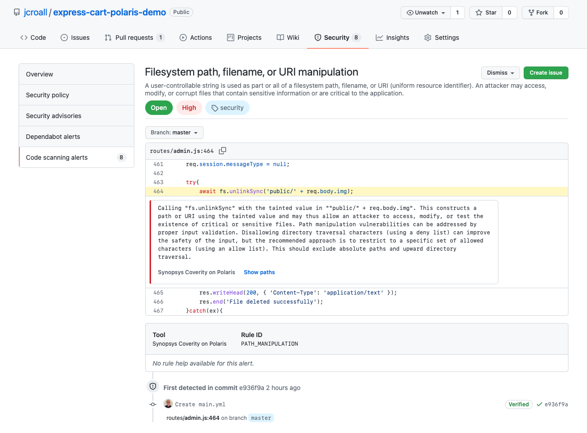
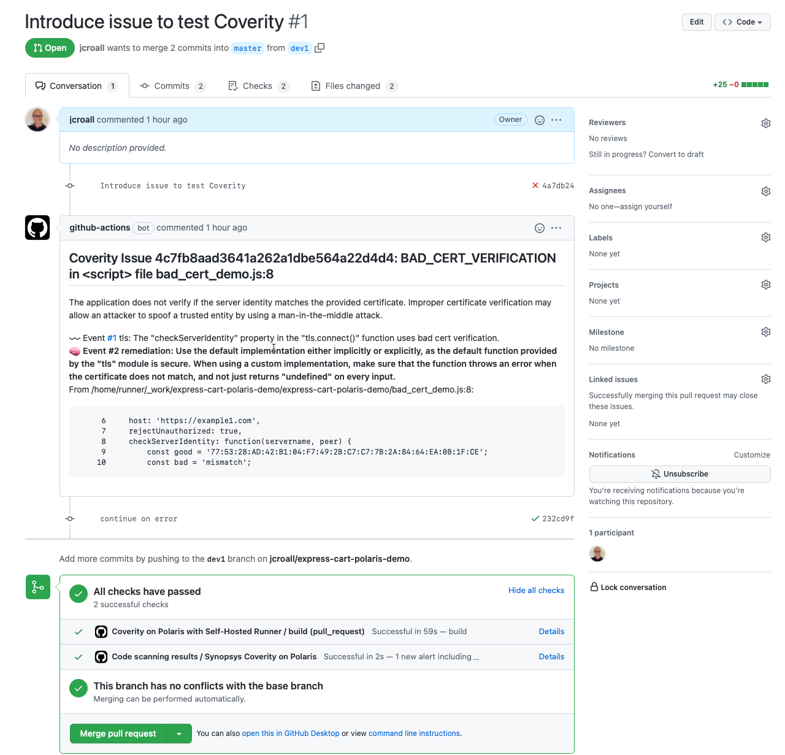

# Synopsys GitHub Templates

Modern applications are a complex mix of proprietary and open source code, APIs and user interfaces, application behavior, and deployment workflows. Security issues at any point in this software supply chain can leave you and your customers  at risk. Synopsys solutions help you identify and   manage software supply chain risks end-to-end.

The Synopsys GitHub DevOps Templates repository contains GitHub workflow .yml templates that allow you to integrate Synopsys AST soltuions into your GitHub Actions based pipeline. It is recommended that you clone this repo into a copy within your own organiaztion, and then leverage these workflows according to GitHub best practices:

- [Sharing workflows, secrets, and runners with your organization](https://docs.github.com/en/actions/learn-github-actions/sharing-workflows-secrets-and-runners-with-your-organization).
- [Using workflow templates](https://docs.github.com/en/actions/learn-github-actions/using-workflow-templates)

These templates and scripts are provided under an OSS license (specified in the LICENSE file) and have been developed by Synopsys field engineers as a contribution to the Synopsys user community. Please direct questions and comments to the approproate forum in the Synopsys user community.

# Available Templates

## Coverity on Polaris

Run a Coverity SAST scan on the Polaris platform as part of your pipeline. There are two instances of this recipe:

- coverity-on-polaris-github-hosted.yml - Runs Coverity on a GitHub-hosted agent. **Note: The overhead of running an incremental analysis in this way can be prohibitive due to the Coverity tools download size. If you plan to use incremental analysis it is recommended that you use a self-hosted runner.**
- coverity-on-polaris-self-hosted.yml - Runs Coverity on a self-hosted runner. **Note: This requires a specific docker image (provided in this repository) to be used as the self-hosted runner. Instructions for using this are included below.**

The following secrets must be set in your repository or organization:

| Secret name | Description |
| --- | --- |
| POLARIS_URL | Set this to your individual customer Polaris URL (e.g. customer.polaris.synopsys.com) |
| POLARIS_URL | Set this to your Polaris access token |

The following environment variables may be set in your instance of the workflows:

| Variable | Description |
| --- | --- |
| SECURITY_GATE_ARGS | The default value is "--new" which will return all newly introduced security issues. TODO: Explain options here |

These templates both us the Polaris command line utility to perform an "auto capture" of your source code (no need to understand how the software is built) and uploads the source code and dependencies to Polaris for analysis. They are configured with different behavior for different scenarios:

### Build for master branch

When performing a build for the master branch, a full Coverity analysis will be run and SARIF will be generated for all issues found. SARIF is only supported if you are using a public repository or have licensed GitHub Advanced Security including CodeQL and Dependabot. If new issues are found matching the "security gate" parameter, an exit code will be returned to indicate the pipeline has failed.

TODO: Set a GitHub-specific "status" code of success or error based on the seucrity testing results and security gate policy.




### Build for a pull request

When performing a build to validate a pull request, an incremental analysis will be run on only the changed files, SARIF will be generated if you are using GitHub Advanced Security, and the pull request will be annotated with comments to direct the developer to issues that may prevent a merge (this is available even if you are not using GitHub Advanced Security).

TODO: Set a GitHub-specific "status" code of success or error based on the seucrity testing results and security gate policy in case SARIF is not being used.



### Using the Self-Hosted Runner

Polaris incremental analysis is a technology preview, and at this time requires the analysis to be run locally. When using an ephemeral GitHub-hosted runner, the Coverity analysis tools must be downloaded and installed at a cost of ~ 1.5 GB for each job invocation which greatly reduces the performance gains of using incremental analysis, and places a great burden on the network infrastructure. In theory GitHub caching could be used to store a local copy, but this is not reliable as when the cache reaches its quota limit files may begin to be deleted at GtiHub's discretion.

To work around this and provide the best performance, it is recommended to host your own self-hosted runners. We provide [a Docker image](docker/coverity-on-polaris-runner/) that is configured with the necessary tools to run the GitHub runner software, plus on invocation will prime itself with the latest version of the Coverity analysis tools. This means that each instance of the runner you initailize, a copy of the 1.5 GB software will be downloaded, but it will be re-used for every job the runner services. If a new version of the Coverity tools is published while the runner is in service, it will be downlaoded on the fly. The job currently being serviced will take a hit, but each subseqent job will run quickly.

The Docker image may be used as follows. 

First, build the image. For example:
```
docker build -t coverity-on-polaris-runner .
```

Next, launch the runner with the following environment variables to connect it to your GitHub environment. This example will run it by hand, but it is expected this would be run from a management infrastructure. 

To use the runner for a specific repository:

```
docker run --name coverity-on-polaris-runner \
     -e GITHUB_OWNER=[username or organization] \
     -e GITHUB_REPOSITORY=[repository name] \
     -e GITHUB_PAT=[GitHub Personal Access Token] \
     -e POLARIS_URL=[Your individual customer Polaris URL] \
     -e POLARIS_ACCESS_TOKEN=[Your Polaris Access Token] \
     coverity-on-polaris-runner
```

To use the runner organization-wide, leave out the repository:

```
docker run --name coverity-on-polaris-runner \
     -e GITHUB_OWNER=[username or organization] \
     -e GITHUB_PAT=[GitHub Personal Access Token] \
     -e POLARIS_URL=[Your individual customer Polaris URL] \
     -e POLARIS_ACCESS_TOKEN=[Your Polaris Access Token] \
     coverity-on-polaris-runner
```

# Support

For questions and comments, please contact us via the [Polaris Integrations Forum](https://community.synopsys.com/s/topic/0TO2H000000gM3oWAE/polaris-integrations).


