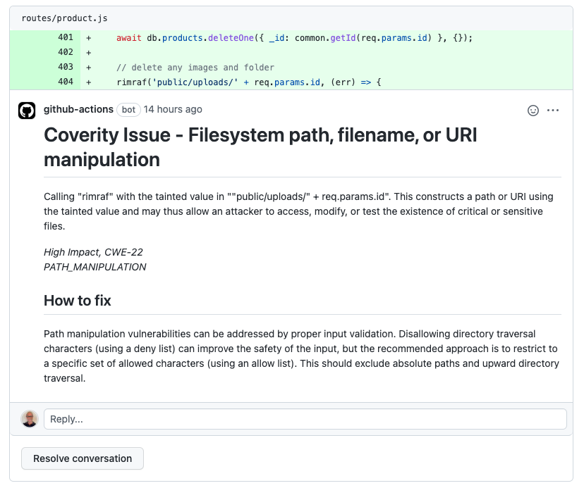
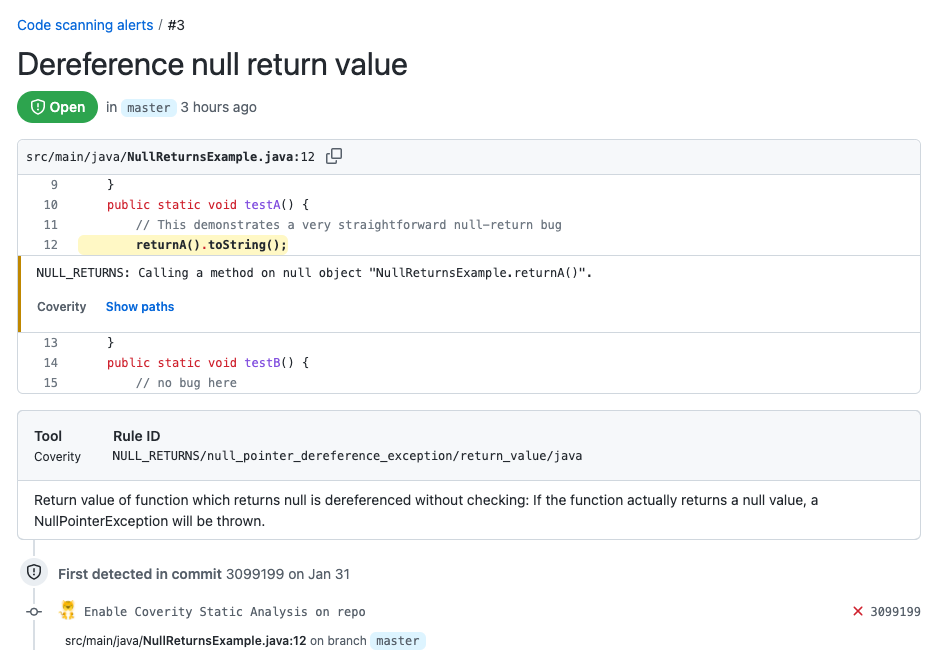
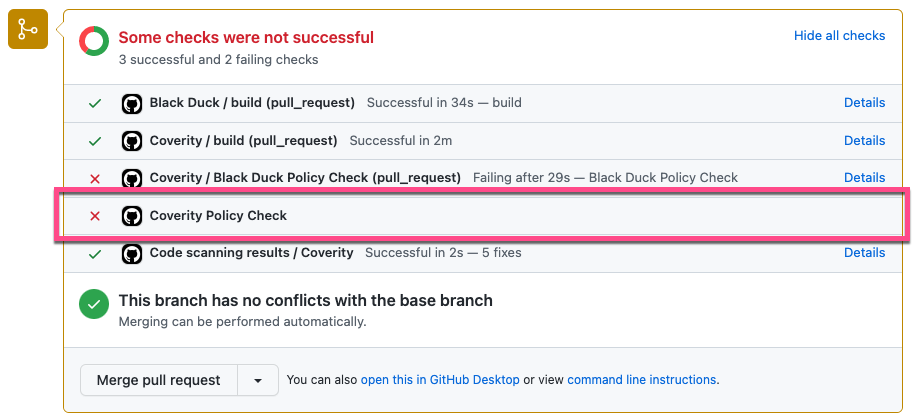

# Coverity GitHub Template

The Coverity GitHub Template provides a fully functioning reference implementation of Coverity running within a GitHub
workflow, implemented as a fully documented composite GitHub Action. This means that you can use this template as an 
Action to easily implement it in your workflows, but because it contains only GitHub configuration as code, you can
also copy it and modify it to suit your needs.

In this template we have attempted to document all of our known Coverity & GitHub best practices, and provide options
so that you can easily enable/disable various components. However, Coverity supports a very wide range of deployment
scenarios, and it is possible that this will not meet your needs as-is. In such case, you are welcome to clone or fork
this repo and modify to suit your needs - you can then reference your copy from your pipeline!

## Quick Start

To get started, you can include the template in your pipelines by referencing it as a GitHub Action.
Replace `<version>` with the version of the template you would like to use. You can use `master` to reference the latest version,
but be advised that this is dangerous as it may introduce changes that disrupt your pipeline.

To start using this action, add the following step to your existing GitHub workflow. This enables assumes the specified
Coverity credentials and some reasonable options, which are described in depth in following sections:

```
      - uses: synopsys-sig-community/synopsys-github-templates/coverity@<version>
        with:
          coverity-url: ${{ secrets.COVERITY_URL }}
          coverity-user: ${{ secrets.COVERITY_USER }}
          coverity-passphrase: ${{ secrets.COVERITY_PASSPHRASE }}
          coverity-project-name: ${{ github.event.repository.name }}
          coverity-checker-options: --webapp-security
          create-stream-and-project: true
          github-token: ${{ secrets.GITHUB_TOKEN }}
```

**Note:** This template assumes that it will be running in the context of a self-hosted GitHub runner, with the Coverity tools
installed, configured and available in the PATH. Due to the large footprint of the traditional Coverity toolchain, we
recommend using a self-hosted runner. A separate template will be made available for use with the new Coverity Scan Service.

## Capabilities

The Coverity GitHub Template supports the following capabilities:

### Synthesize Stream and Project Names

In order to speed deployment to new projects, the template can create stream and project names automatically based on the
GitHub environment. The names are derived as follows:

| Name | Value |
| --- | --- |
| **Stream Name** | The stream name will be derived from the repository name AND the branch name, e.g.:<br>`[repo name]-[branch-name]`<br><br>Specifically, this is set to:<br>`${GITHUB_REPOSITORY##*/}-${GITHUB_REF##*/}`<br><br>For pull requests, the base ref is used:<br>`${GITHUB_REPOSITORY##*/}-${{ github.base_ref }}`|
| **Project Name** | The project name will be derived from the repository name only, e.g.<br>`[repo-name]`<br><br>Specifically, this is set to:<br>`${GITHUB_REPOSITORY##*/}` |

You can override these synthetic names by specifying the following options to the template:

| Option | Description |
| --- | --- |
| **coverity-stream-name** | Specify the name of the stream to commit to |
| **coverity-project-name** | Specify the name of the project where results will be available |

### Automatically Create Streams and Projects

Also in order to speed deployment to new projects, the template can create the streams and projects if they do not exist
on the Coverity Connect server. This can be very helpful for on-boarding new projects - you can deploy without having any
project specific data in the GitHub workflows, and without doing any pre-preparation on the server. Simply install the template
and go!

Automatic stream and project creation is off by default and must be enabled with the following option:

| Option | Description |
| --- | --- |
| **create-stream-and-project** | Enable automatic stream and project creation using either the names specified or synthesized.<br><br>Must be `true` or `false` (Case sensitive) |

### Build Capture or Auto Capture

Coverity's auto capture technology is helpful for on-boarding new projects, as it requires zero knowledge of the project - languages
used, build system, package managers, etc. For on-boarding new projects (Note: C/C++, Swift and Objective-C are not supported) this
is an easy choice as all you need to do is deploy the template. Build capture can produce more comprehensive results, but will require
knowledge of how the project is built.

The default behavior of the template is auto capture.

To enable build capture, please use the following option:

| Option | Description |
| --- | --- |
| **build-command** | Enable build capture, using the value provided as the build command. This is passed directly to cov-build. For example:<br><br>`mvn clean && mvn package` | 
| **cov-build-options** | Pass command line parameters to cov-build. These are passed directly to cov-build, before providing the build command |

### Incremental Analysis and Developer Feedback for Pull Requests

The template will apply Coverity incremental analysis (cov-run-desktop) instead of a full analysis (cov-analyze) when running
in the context of a pull request. This will provide fast turnaround time, and focus developers on the newly introduced issues
rather than everything in the project.

The [Coverity Report Output V7 JSON Action](https://github.com/synopsys-sig/coverity-report-output-v7-json) is used to
provide feedback to developers. 



**Note:** A full build or auto capture is still used during pull requests - only the analysis step is incremental. For many projects
this is a good trade-off - Java for example tends to have fast build times, and by capturing the entire project the incremental
analysis will have to make fewer assumptions about the code being analyzed, leading to higher confidence results.

### Integrate with GitHub Advanced Security

GitHub Advanced Security provides native support for static analysis findings through SARIF import. If you are using public
repos, or have licensed GitHub Advanced Security in addition to Coverity, this can provide a nice native workflow for managing
Coverity SAST findings within GitHub. These results are available for pushes as well as pull requests.

To enable this integration with GitHub Advanced Security, please use the following option:

| Option | Description |
| --- | --- |
| **generate-sarif** | Enable SARIF export for GitHub, set to `true` or `false` (or leave out) |


If you are not using public repos or are licensed for GitHub Advanced Security, the Coverity GitHub Action invoked on pull requests
provides the same level of detail and remediation advice for developers.



### Security Gate

The template has the ability to "fail the build" if a security policy is not met. Rather than generate an exit code that will
mark the entire pipeline as failed, a GitHub status check is created called "Coverity Policy Check" and this is set according to
the security gate. This allows your build and other workflows to each have their own status, and a branch protection policy can be
set to block merges if the policy is not met.



#### Pushes and Full Scans

To enable a security gate on pushes with full scans, first configure a saved view in Coverity Connect that represents your security
policy. Any defects that match the saved view's filters, for the project being tested, will be counted as policy violations:


Then specify the name of the saved view in the template options:

| Option | Description |
| --- | --- |
| **security-gate-view-name** | Specify the name of the saved view in Coverity Connect to use for the push security gate |

#### Pull Requests and Incremental Analysis

Due to the typically low volume of findings returned from an incremental analysis, the security policy for pull requests
with incremental analysis is any *new* issues.

### Other options

The template has a few additional options that do not fit in the above categories:

| Option | Description |
| --- | --- |
| **cov-analyze-options** | Pass command line parameters to cov-analyze and cov-run-desktop. |
